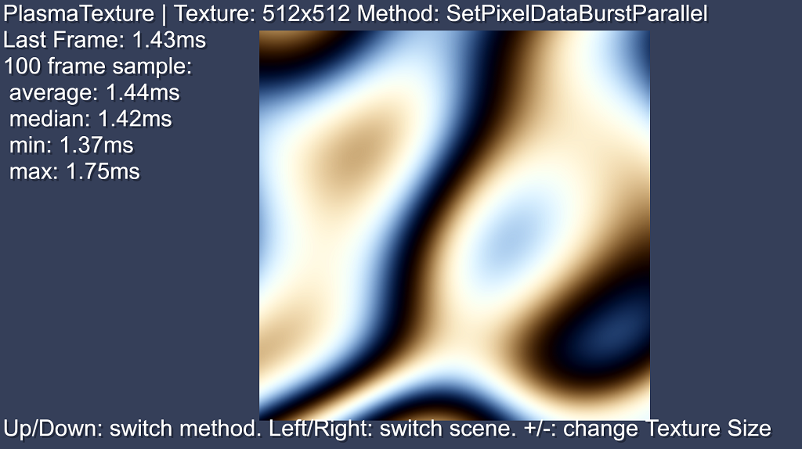

# Unity 2021.3+ Texture Access API examples
**Note: most API's should already exist in 2020 LTS.**

This version of the sample project accompanies a [blogpost](https://blog.unity.com/engine-platform/accessing-texture-data-efficiently) covering the used API.

